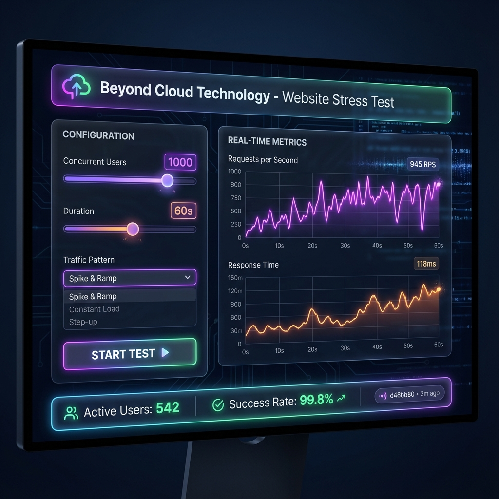

# Beyond Cloud Technology - Website Stress Test



## 🌐 Public Access
**Live URL:** [https://website-stress-test.beyondcloud.technology/](https://website-stress-test.beyondcloud.technology/)

---

## 🚀 Overview
The **Website Stress Test** is a professional-grade load testing tool designed to simulate realistic traffic patterns on your web applications. It helps developers and QA engineers identify bottlenecks, test scalability, and ensure production readiness.

Built with a **modern, high-performance architecture**, it includes a custom NodeJS proxy server to bypass CORS restrictions and allow testing of any target URL.

## ✨ Key Features

### 🛠️ Core Functionality
*   **Custom HTTP Methods**: Support for GET, POST, PUT, DELETE, and PATCH.
*   **Configurable Load**: Adjust concurrent users (up to 5000) and test duration.
*   **Traffic Patterns**:
    *   **Steady**: Constant load.
    *   **Burst**: Sudden spikes to test resilience.
    *   **Ramp-up**: Gradual increase to find breaking points.
    *   **Random**: Simulate unpredictable real-world traffic.
*   **Crawler Mode**: Automatically crawls the target website to test multiple pages and paths, not just the entry point.

### 📊 Real-Time Analytics
*   **Interactive Charts**: Live visualization of Requests Per Second (RPS) and Response Times.
*   **Detailed Metrics**: Track Active Users, Bandwidth, Success Rates, and Error breakdown (4xx, 5xx, Timeouts).
*   **Percentiles**: Monitor P50, P95, and P99 latency metrics.

### 🎨 User Experience
*   **Modern UI**: Sleek, glassmorphism-inspired design with Light/Dark mode support.
*   **Git Versioning**: Automatic display of the current Git Commit ID and deployment age in the UI.
*   **Responsive Design**: Fully functional on desktop and tablet devices.

---

## 📦 Installation & Setup

### Prerequisites
*   Node.js (v18 or higher)
*   Nginx (for production deployment)
*   PM2 (for process management)

### 💻 Local Development
1.  **Clone the Repository**
    ```bash
    git clone https://github.com/DeNNiiInc/Website-Stress-Test.git
    cd Website-Stress-Test
    ```

2.  **Install Dependencies**
    ```bash
    npm install
    ```

3.  **Start the Proxy Server**
    ```bash
    npm start
    ```
    The server will start on `http://localhost:3000`.

4.  **Open the Application**
    Open `index.html` in your browser or serve it using a static file server (e.g., Live Server).

---

## 🚀 Deployment Guide (Proxmox / Ubuntu)

This project includes automated deployment scripts for Proxmox/Ubuntu environments.

### 1. Configuration
Copy `deploy-config.example.json` to `deploy-config.json` and update with your server details:
```json
{
  "host": "YOUR_SERVER_IP",
  "username": "root",
  "password": "YOUR_PASSWORD",
  "remotePath": "/var/www/website-stress-test",
  "repoUrl": "https://github.com/DeNNiiInc/Website-Stress-Test.git",
  "githubToken": "YOUR_GITHUB_TOKEN",
  "appName": "website-stress-test"
}
```

### 2. Auto-Deployment
Run the PowerShell deployment script:
```powershell
./start-deployment.ps1
```
This script will:
*   Connect to your server via SSH.
*   Install Nginx and Node.js if missing.
*   Clone/Pull the latest code.
*   Configure Nginx as a reverse proxy.
*   Set up a Cron job for auto-updates.

### 3. Auto-Sync
The system automatically checks for Git updates every 5 minutes. If changes are detected, it pulls the code, installs dependencies, and restarts the backend process without downtime.

**Manual Update Trigger:**
```bash
/var/www/website-stress-test/auto-sync.sh
```

---

## 🔧 Architecture

### Backend (`proxy-server.js`)
*   **Role**: Handles CORS requests and authenticates traffic.
*   **Port**: 3000 (Internal).
*   **Endpoints**:
    *   `/proxy`: Forwards stress test requests.
    *   `/git-info`: Returns current commit hash and deployment date.

### Frontend (`index.html` + `script.js`)
*   **Technology**: Vanilla JS + Chart.js.
*   **Communication**: Fetch API to the Proxy Server.

---

## 📝 License
MIT License - Copyright (c) 2025 Beyond Cloud Technology.
